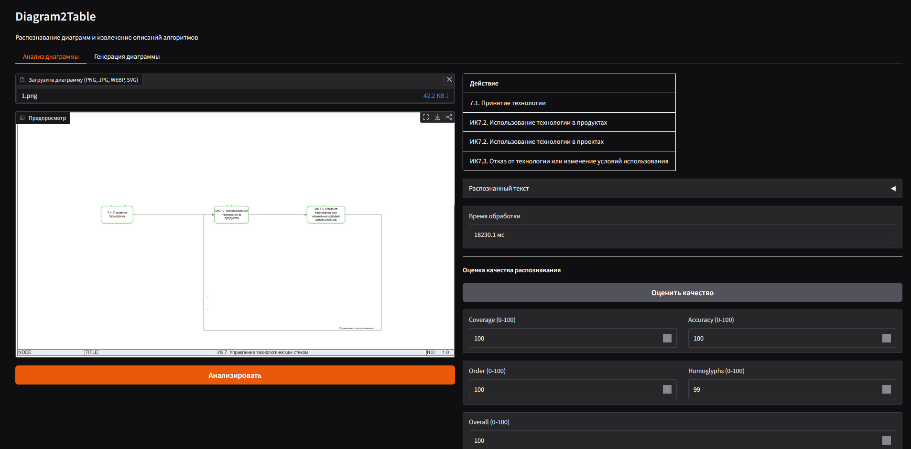

# DIAGRAM2TABLE

## Описание
DIAGRAM2TABLE — инструмент для преобразования изображений диаграмм (flowchart, BPMN и др.) в структурированные markdown таблицы. Решение автоматизирует извлечение информации из визуальных схем.

## Квикстарт (Быстрый старт)

### 1. Локальный запуск
1. Создайте виртуальное окружение:
	```cmd
	python -m venv .venv
	.venv\Scripts\activate
	```
2. Установите зависимости:
	```cmd
	pip install -r requirements.txt
	```
3. Для ускорения на GPU (CUDA):
	```cmd
	pip install --force-reinstall torch torchvision --index-url https://download.pytorch.org/whl/cu130
	```
4. Для поддержки SVG: установите ImageMagick и делегаты.
	- Windows: https://imagemagick.org (опция "Install development headers")
	- Linux: `sudo apt install imagemagick libmagickwand-dev librsvg2-bin`

5. Скачайте модели:
	```cmd
	python scripts/download_models.py
	```

6. Запустите приложение:
	```cmd
	python -m src.main both --deployment-mode vlm_quantized
	```

### 2. Docker
Сборка:
```cmd
docker build -t diagram2table:local -f docker/Dockerfile .
```
или
```cmd
docker compose -f docker/docker-compose.yml build --progress=plain --no-cache diagram2table-gpu
```
Запуск (убедитесь, что находитесь в директории docker):
```cmd
docker compose up diagram2table-gpu
```

> Если при сборке появится ошибка `MagickWand shared library not found` — убедитесь, что пакеты `libmagickwand-dev` и `imagemagick` установлены. Если SVG всё ещё не рендерится, добавьте пакет `librsvg2-bin` (в Dockerfile уже включён) и проверьте `/etc/ImageMagick-6/policy.xml`.

## Воспроизводимость и ознакомление
- Все зависимости указаны в requirements.txt и pyproject.toml
- Dockerfile и docker-compose.yml обеспечивают воспроизводимость среды
- Скрипт scripts/download_models.py скачивает необходимые модели
- Примеры данных и тестовые файлы находятся в папках data/, data2/, data3/
- UI доступен по адресу http://localhost:7860 после запуска
- API доступен через endpoints, см. src/api/routes/

## Полезные ссылки
- [arxiv.org/abs/2511.22448](https://arxiv.org/abs/2511.22448)
- [ieeexplore.ieee.org/document/9980425](https://ieeexplore.ieee.org/document/9980425)
- [huggingface.co/jtlicardo/bpmn-information-extraction-v2](https://huggingface.co/jtlicardo/bpmn-information-extraction-v2)
- [github.com/PROSLab/BPMN-Redrawer](https://github.com/PROSLab/BPMN-Redrawer)

## Контакты
Для вопросов и предложений пока что используйте раздел Issues.